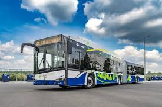

1. TEAM:  
   1. Sebastian Duda SebastianDuda0106 tasks:  
       1,2,3,4,5,6

# 1. Introduction  
This task is about public transport in kraków and this file is also about this necessary and everyday thing we use i don't know what more to say, this project is made by me myself and I and I think creativity is not my strong suit but I have to do it anyway

the first and most used form of public transportation is going on a bus since it is easily accesibble and can drive you anywhere, the prices vary depending on the need but while it is the easiest form of transport it is relatively slow and costly especially if you have to go far

another form of public transportation is a train, while it requires tracks to be drive on it is much more fuel and cost efficient to go on a train for a long distance trip than to get a texi or a bus, it is also much faster than other forms of transport

# 2. Data  
the table below is showing the prices of the public transport tickets in Krakow, how long they last, and their areas of effect. The prices may be different depending on the city:  
|Type|Area|Time of effect|Price|
|----|-----|--------------|-----|
|normal|1|30 days|95 PLN|
|reduced|1|30 days|43 PLN|
|normal|1+2|30 days|130 PLN|
# 3. Images  

